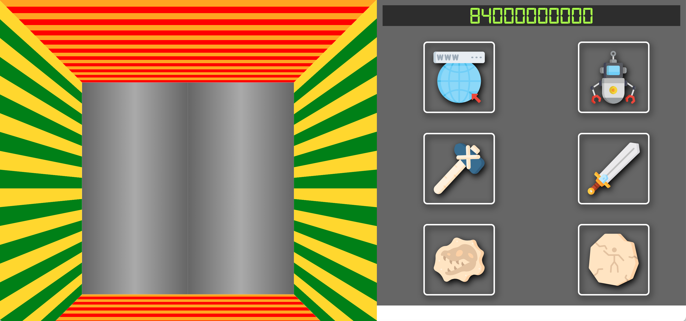

# CSS-to-the-rescue

**Week 1, eerste feedbacksessie en plan bespreken**

Mijn plan is om een pov vanuit een lift te maken, en een control panel rechts om de lift te bedienen. De lift is een soort tijdmachine die door de tijd heen gaat, de 'laagste' verdieping is de tijd van de dino's, de 'hoogste' verdieping is in de toekomst. 

Als de lift beweegt wil ik hem laten trillen, zodat het echt lijkt alsof de lift omhoog beweegt. Ook wil ik de nummers laten draaien tot ze bij het juiste jaartal zijn. Een beetje het effect van een slot machine. 

**Week 2, maandag 3 mrt**
Vandaag, met hulp van Stijn, de knoppen naast de lift gezet. We hebben hiervoor gebruik gemaakt van een grid. Vervolgens heb ik de animatie die er al in stond op de hover, op de knoppen gezet. Al met al heb ik een hoop gedaan vandaag en ik ben blij met de vooruitgang.

Wat ik morgen graag wil doen is het volgende:
 - Het scherm voor de jaartallen
 - Een 'digitaal' font inladen
 - De knoppen er meer als knoppen uit laten zien (border?)
 

**Week 2, dinsdag 4 mrt**
Wat ik op de planning had staan voor vandaag heb ik kunnen doen. Het duurde wel de hele dag maar het is uiteindelijk gelukt. Nieuwe dingen die ik vandaag gedaan heb zijn:
 - Een font inladen
 - Een drop shadow geven (aan de buttons)
 - Gebruik gemaakt van border-box om een border aan de binnenkant te krijgen (schermpje met jaartallen)

Ik ben ook begonnen met het expirimenteren van :has om de knoppen van de lift het gewenste effect te laten doen. Volgende keer wil ik het volgende doen:
 - De buttons de deur laten sluiten en weer openen
 - De divjes (muren) om de liftdeuren stylen
 - De tekst aanpassen bij het drukken op de buttons (:has?)

 

